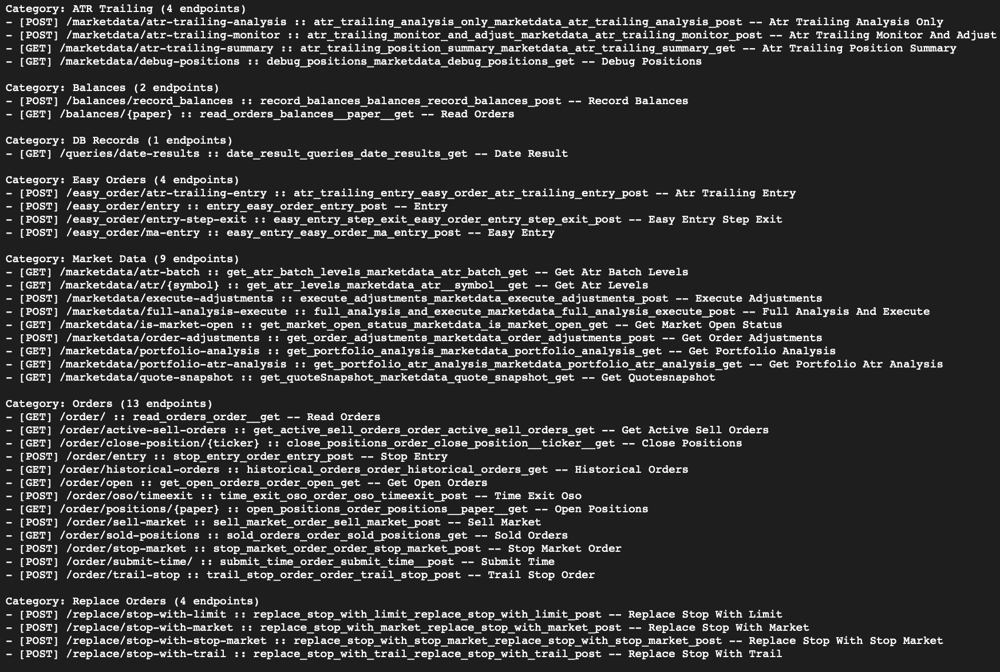
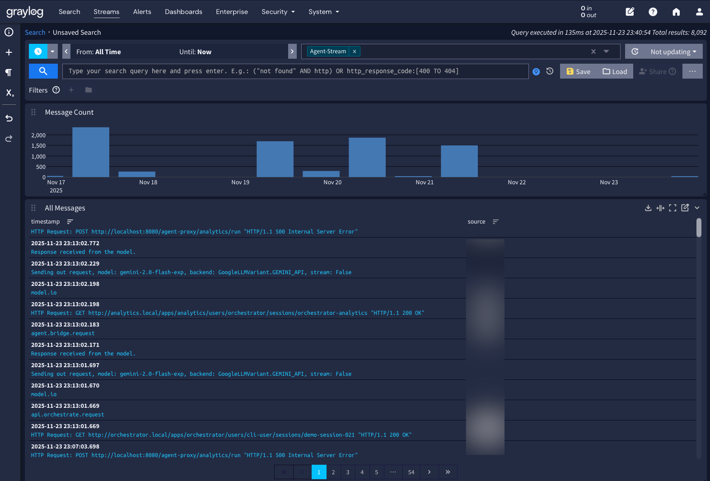
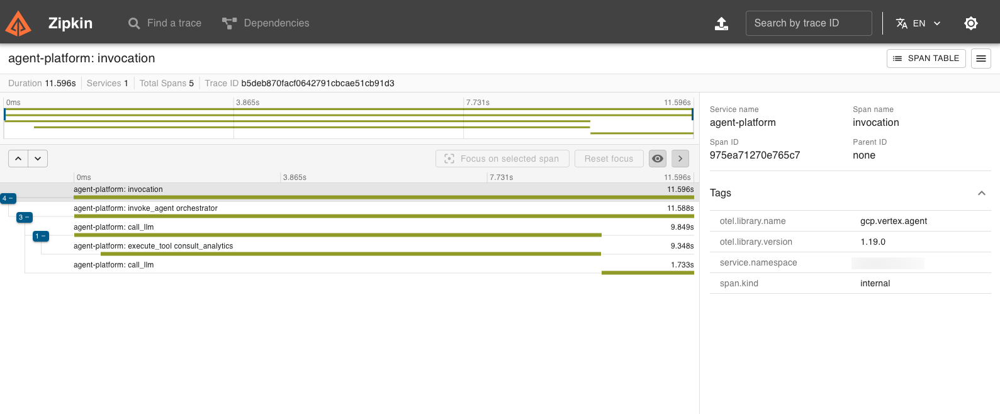
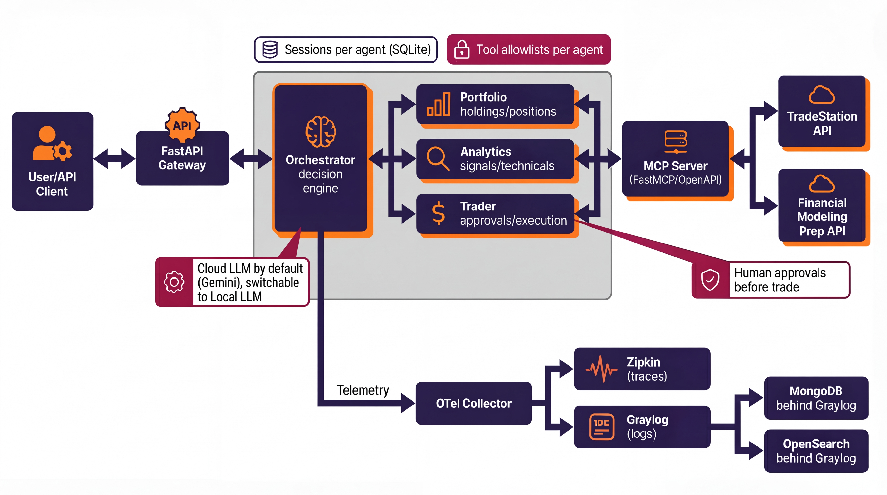
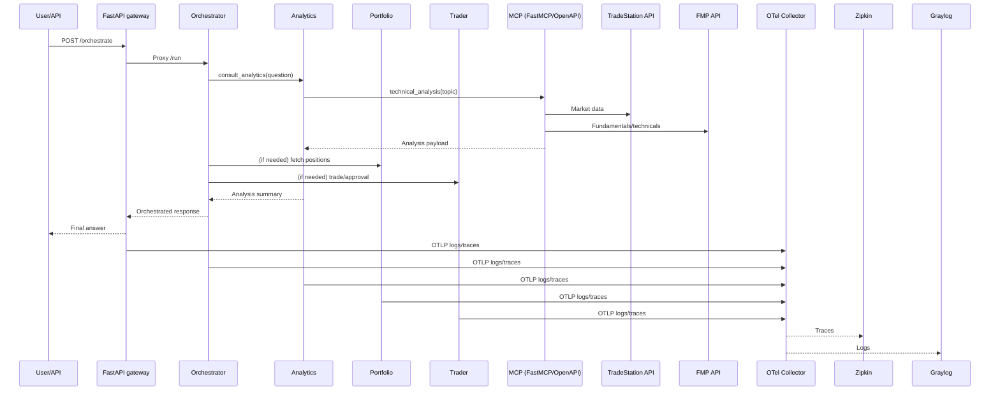

# Hybrid Equity Capital Markets Associate

The Equity Capital Markets Associate is a multi-agent trading assistant built with Google ADK for development and FastAPI for deployment. It includes four specialists (Orchestrator, Portfolio, Analytics, Trader), a shared MCP tool client, Graylog instrumentation over gRPC, and a LiteLLM-compatible model setup, enabling you to replace Gemini with local Ollama/MLX models to maintain security compliance.

## Repository Layout

- `agents/<name>/agent.py` &mdash; individual ADK agents with telemetry + SQLite session wiring.
- `common/` &mdash; shared config, MCP client, telemetry hooks, Telegram approvals, and tools.
- `fastapi_app/main.py` &mdash; unified FastAPI service that mounts all agents under `/agents/<name>` and exposes `/orchestrate` for API clients.
- `reference/` &mdash; background docs, architecture notes, MCP tool catalog.
- `.env.example` &mdash; all required secrets and runtime knobs (Graylog, MCP server, Telegram, LiteLLM, etc.).

## Environment Setup

```bash
python -m venv .venv
source .venv/bin/activate
pip install -r requirements.txt
cp .env.example .env
# Edit .env with Google API key, MCP URL (0.0.0.0:8085), Graylog endpoint (0.0.0.0:4317), Telegram data, and MCP allowlists per agent
```

Set `MODEL_PROVIDER=gemini` for default Gemini Cloud usage or switch to `MODEL_PROVIDER=litellm` with `LITELLM_BASE_URL` (e.g., `http://localhost:11434` for Ollama) and `LITELLM_MODEL` pointing at the desired local model. Session files live in `data/sessions/<agent>.db`; keep this folder persistent when deploying.

### Agent-to-Agent URLs

When running the consolidated FastAPI server, the orchestrator reaches peers via the mounted routes:

- `PORTFOLIO_URL=http://localhost:8080/agent-proxy/portfolio`
- `ANALYTICS_URL=http://localhost:8080/agent-proxy/analytics`
- `TRADER_URL=http://localhost:8080/agent-proxy/trader`
- `ORCHESTRATOR_URL=http://localhost:8080/agent-proxy/orchestrator`

If you launch agents individually with `adk web`, override these to point at the per-agent ports (for example `http://localhost:8011` for the portfolio agent).

## Docker Usage

### Local Development (Docker Desktop)

```bash
docker compose up --build
# or rebuild after dependency changes: docker compose build --no-cache
```

- The stack now includes an OpenTelemetry Collector (`otel-collector` contrib), Zipkin (`:9411`), Graylog UI (`:9000`), MongoDB, OpenSearch, and the FastAPI service. FastAPI stays on `http://localhost:8080`; OTLP gRPC/HTTP endpoints are exposed on `4317/4318` for troubleshooting.
- `.env` is auto-loaded; update it with your Graylog OTLP gRPC input (`GRAYLOG_OTLP_EXPORTER_ENDPOINT`, default `0.0.0.0:4317`), MCP host (`0.0.0.0:8085`), Telegram data, and model settings. The app automatically ships to `otel-collector:4317` unless you override `GRAYLOG_OTLP_GRPC_ENDPOINT`.
- The MCP client honors per-tool overrides via env vars like `MCP_TOOL_ENDPOINT_get_positions=GET:/positions/false`. Use this format to map tools to custom routes (e.g., `MCP_TOOL_ENDPOINT_technical_analysis=GET:/market/analysis/{topic}` — placeholders are replaced with payload values). Default fallback is `POST /tools/<name>`.
- Use Docker Desktop logs or `docker compose logs -f trader-agent` to inspect Graylog export events.
- Graylog: browse to `http://localhost:9000` (admin/admin unless overridden). OTLP/Zipkin are wired by default; Zipkin spans are at `http://localhost:9411`.

### Session DB Migration

If the container refuses to start with `Database ... seems to use an old schema`, migrate the persisted session files after upgrading `google-adk`:

```bash
python scripts/migrate_session_dbs.py
```

The script upgrades every SQLite file under `data/sessions/`, backing up the previous copy to `<name>.db.bak` before swapping in the migrated database (or archiving the old file so a fresh schema can be created if the migration helper is unavailable).

### Production VM Deployment

```bash
# On the VM
docker build -t registry.example.com/trader-agent:prod .
docker run -d \
  --name trader-agent \
  --env-file /opt/agent/.env \
  -p 8080:8080 \
  -v /opt/agent/data/sessions:/app/data/sessions \
  registry.example.com/trader-agent:prod
```

- Ensure outbound connectivity from the VM to Graylog (`0.0.0.0:4317`), the MCP server (`0.0.0.0:8085`), and Gemini or LiteLLM endpoints.
- Mirror `.env` secrets onto the VM and rotate credentials separately from container rebuilds.
- For fleet deployments, push the built image to a registry, then use the same `docker run` or compose file with VM-specific volumes.

## Develop with ADK Web UIs

Each agent can be launched with the ADK CLI while reusing the shared modules:

```bash
cd agents/orchestrator
adk web --agent-dir . --host 0.0.0.0 --port 8010
# Repeat for portfolio (8011), analytics (8012), trader (8013)
```

Traffic between agents is logged via OTLP gRPC, so confirm Graylog connectivity first (`GRAYLOG_OTLP_GRPC_ENDPOINT=0.0.0.0:4317`).

## FastAPI Deployment

Run all agents behind one FastAPI process once you are ready to serve traffic programmatically:

```bash
uvicorn fastapi_app.main:app --host 0.0.0.0 --port 8080 --workers 2
```

- `/health` &mdash; readiness status plus model provider info.
- `/agents/<name>/run` &mdash; native ADK endpoints mounted for each agent.
- `/orchestrate` &mdash; shortcut that proxies a request directly to the Orchestrator via ASGI.

All endpoints emit structured events (`api.*`, `tool.*`, `model.io`) to Graylog. Adjust sampling by editing `GRAYLOG_TRACE_SAMPLE_RATIO` in `.env`.

### Example `curl`

```bash
curl -X POST http://localhost:8080/orchestrate \
  -H "Content-Type: application/json" \
  -d '{
        "text": "Summarize my current holdings and recommend an adjustment.",
        "session_id": "demo-session-001",
        "user_id": "cli-user",
        "agent": "orchestrator"
      }'
```

The response mirrors the native ADK payload, returning the orchestrator's reasoning chain and the final message compiled from downstream agents.

### Sample Technical Analysis Run (QQQ)

Request:

```bash
curl --request POST \
  --url http://localhost:8080/orchestrate \
  --header 'Content-Type: application/json' \
  --data '{
    "text": "Can you please get technical analysis on QQQ ",
    "session_id": "demo-session-022",
    "user_id": "cli-user",
    "agent": "orchestrator"
  }'
```

Sample response (truncated for readability):

```json
[
  {
    "modelVersion": "gemini-2.0-flash-exp",
    "content": {
      "parts": [
        {
          "functionCall": {
            "name": "consult_analytics",
            "args": {"question": "Provide technical analysis on QQQ"}
          }
        }
      ],
      "role": "model"
    },
    "author": "orchestrator"
  },
  {
    "content": {
      "parts": [
        {
          "functionResponse": {
            "name": "consult_analytics",
            "response": {
              "result": [
                {"content": {"parts": [{"functionCall": {"name": "generate_market_insight", "args": {"topic": "QQQ"}}}], "role": "model"}},
                {"content": {"parts": [{"functionResponse": {"name": "generate_market_insight", "response": {"symbol": "QQQ", "current_price": 590.07, "ma_distances": {"ma1hr": {"value": 601.69, "distance_percent": -1.93}, "ema9": {"value": 600.91, "distance_percent": -1.8}, "ma10": {"value": 605.87, "distance_percent": -2.61}, "ema21": {"value": 607.56, "distance_percent": -2.88}, "ma30": {"value": 612.3, "distance_percent": -3.63}, "ma50": {"value": 607.15, "distance_percent": -2.81}, "ma100": {"value": 587.55, "distance_percent": 0.43}, "ma200": {"value": 543.5, "distance_percent": 8.57}}, "atr": {"atr_percentage": 1.86}, "rsi": {"rsi": 43.16098073397344}, "adx": {"adx": 15.267777641919679}}}}], "role": "user"}},
                {"content": {"parts": [{"text": "Here's a technical analysis of QQQ..."}], "role": "model"}}
              ]
            }
          }
        }
      ],
      "role": "user"
    },
    "author": "orchestrator"
  },
  {
    "content": {
      "parts": [
        {
          "text": "The Analytics Agent provided a technical analysis of QQQ ... Short-term neutral to slightly bearish, long-term bullish."
        }
      ],
      "role": "model"
    },
    "author": "orchestrator"
  }
]
```

## MCP, Telegram, and Governance

- Edit `*_MCP_TOOL_ALLOWLIST` variables to restrict which Model Context Protocol tools are visible per agent. Document the mappings in `reference/MCP_TOOLS.md`.
- Telegram approvals require `TELEGRAM_BOT_TOKEN`, `TELEGRAM_CHAT_ID`, and `TELEGRAM_APPROVER_USERNAME`. Set `HUMAN_APPROVAL_REQUIRED=false` to bypass the workflow for automated tests.
- The Orchestrator, Portfolio, Analytics, and Trader tools call the MCP server at `0.0.0.0:8085` with retries and detailed logging. Update `.env` if the server URL or auth token changes.

### MCP Endpoint Map



## Observability

- Logs, traces, and custom events stream through the bundled OpenTelemetry Collector (contrib build). Agents send OTLP gRPC traffic to `otel-collector:4317`; the collector forwards traces to Zipkin and logs to the OTLP endpoint you configure.
- If deploying outside Docker Desktop, run the collector sidecar on the VM (using `observability/otel-collector-config.yaml`) or point `GRAYLOG_OTLP_GRPC_ENDPOINT` directly at an existing collector/telemetry backend.
- Use the `reference/` folder to capture dashboards or tool schemas synced from the trading-agents reference repository: `~/AI Agents Intensive 5 Day Google-Kaggle/capstone_project/trading-agents`.

### Observability Screenshots





## MCP Server (external dependency)

This repo does not ship an MCP server. The endpoints used by the agents were generated with [FastMCP](https://gofastmcp.com/integrations/openapi) from an OpenAPI spec that wraps a private REST layer combining the [TradeStation API](https://api.tradestation.com/docs/) and the [Financial Modeling Prep API](https://site.financialmodelingprep.com/developer/docs). Point `MCP_SERVER_URL` to your running tMCP instance; the tool endpoint overrides in `.env` map agent tool names to the generated routes.


## Problem, Solution, and Value

- **Problem**: Individual traders and small teams lack a governed workflow to combine portfolio state, analytics, and execution while keeping humans in the loop for risk and compliance.
- **Solution**: A multi-agent trading copilot with clear division of labor (orchestrator, portfolio, analytics, trader) backed by MCP tools, approvals, and observability. FastAPI hosts all agents behind a single API for programmatic use.
- **Value**: Faster, safer trading decisions with auditable tool calls, human-gated execution, and pluggable models (Gemini by default, LiteLLM/Ollama optional).

## Architecture Overview



CMA workflow: img/CMA_Workflow.png




Rendered SVG: reference/architecture.svg


- Agents are mounted under one FastAPI process for low-latency routing; URLs can be pointed at external agent processes if needed.
- MCP tool client enforces per-agent allowlists and supports endpoint overrides via env.
- Human approvals flow through Telegram (or can be bypassed in `.env` for tests).
- Session DBs are per-agent SQLite files under `data/sessions`.

### Demo (Insomnia)


## Features Demonstrated

- Multi-agent orchestration with delegated calls between specialists (`agents/orchestrator/agent.py` → portfolio/analytics/trader).
- Tool integration via MCP with allowlists, retries, and endpoint overrides (`common/mcp.py`, `common/tools.py`).
- Human-in-the-loop governance for execution (`common/notifications.py`, trader tools for approvals).
- Observability with OTLP export to Graylog (`common/telemetry.py`, docker compose collector).
- Model provider abstraction: Gemini default, LiteLLM/Ollama alternative (`common/models.py`, `.env` flags).
- Session/state management via SQLite stores per agent (`common/sessions.py`).

## Quickstart & Usage Checklist

1) Install deps and copy env: `python -m venv .venv && source .venv/bin/activate && pip install -r requirements.txt && cp .env.example .env`
2) Populate `.env` with `GOOGLE_API_KEY`, `MCP_SERVER_URL`, Graylog endpoints, Telegram creds (or set `HUMAN_APPROVAL_REQUIRED=false` for local).
3) Run locally: `uvicorn fastapi_app.main:app --host 0.0.0.0 --port 8080`
4) Call orchestrator (example):

```bash
curl -X POST http://localhost:8080/orchestrate \
  -H "Content-Type: application/json" \
  -d '{
        "text": "Summarize my current holdings and recommend an adjustment.",
        "session_id": "demo-session-001",
        "user_id": "cli-user",
        "agent": "orchestrator"
      }'
```

Expected behavior: orchestrator queries portfolio/analytics via MCP tools, summarizes results, and defers execution to trader with approval checks.

## Deployment Notes

- **Docker Compose (local)**: `docker compose up --build` (includes FastAPI + Otel collector). Persist `data/sessions` via volume if desired.
- **VM/Container runtime**: build `docker build -t trader-agent:prod .` then run with `-v /opt/agent/data/sessions:/app/data/sessions` and `--env-file /opt/agent/.env`.
- **Cloud Run/Agent Engine**: same image works; expose port 8080 and ensure outbound access to MCP and Graylog. Document deployed URL and sample run in the writeup if used.

## Gemini Usage

- Default provider is Gemini (`MODEL_PROVIDER=gemini`, `DEFAULT_GOOGLE_MODEL=gemini-2.0-flash-exp`). Set `GOOGLE_API_KEY` and call any agent; responses note the provider in `/health`.
- To switch to local models, set `MODEL_PROVIDER=litellm`, `LITELLM_BASE_URL`, and `LITELLM_MODEL` (e.g., `ollama/gemma:2b`).
